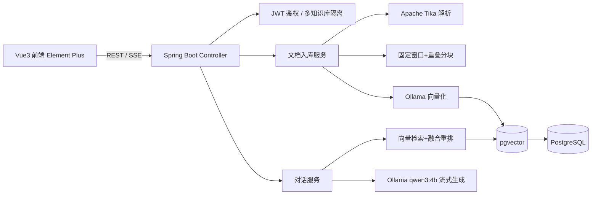

# 智枢 · 企业级 RAG 知识库问答系统

一套**全本地私有化部署**的企业知识库平台：上传企业文档（PDF / Word / Markdown / TXT），系统自动解析、分块、向量化入库；用户以对话方式提问，系统基于**检索增强生成（RAG）**返回**带引用来源的流式答案**。模型完全在本地 Ollama 运行，数据不出域、零 API 成本。

> 技术栈：**Spring AI Alibaba 架构 + 本地 Ollama（qwen3:4b / qwen3-embedding:4b）+ PostgreSQL/pgvector + Vue3 + Element Plus**。

## 架构图



## 技术栈

| 层 | 选型 |
|---|---|
| 后端 | Spring Boot 3.4、Spring AI（Ollama ChatModel / EmbeddingModel / PgVectorStore 抽象） |
| 模型 | 本地 Ollama：`qwen3:4b`（对话）、`qwen3-embedding:4b`（嵌入） |
| 向量库 | PostgreSQL 16 + pgvector（HNSW 索引） |
| 解析 | Apache Tika 2.x |
| 鉴权 | Spring Security + JWT（轻量多租户隔离） |
| 前端 | Vue 3 + Vite + TypeScript + Element Plus + Pinia + fetch-SSE |

## 核心功能

- 多用户登录与 JWT 鉴权，多知识库租户隔离（检索强制按 `kbId` 过滤）
- 文档上传 → Tika 解析 → 分块 → 批量向量化入库，进度可视化（轮询）
- 向量检索 + 关键词融合重排，保证召回相关性
- 流式问答（SSE），答案附带**引用来源标签**
- 知识库 / 文档管理（增删查、状态追踪、分块预览）

## 目录结构

```
EntRAG/
├── docker-compose.yml          # 一键编排 ollama / postgres / backend / frontend
├── README.md
├── backend/                    # Spring Boot 工程
└── frontend/                   # Vue3 工程
```

## 快速开始

### 方式一：Docker 一键启动

```bash
# 1. 启动基础服务（Ollama / Postgres）
docker compose up -d postgres ollama

# 2. 拉取本地模型（首次需等待下载完成）
docker exec -it <ollama容器> ollama pull qwen3:4b
docker exec -it <ollama容器> ollama pull qwen3-embedding:4b

# 3. 启动后端与前端
docker compose up -d backend frontend
```

- 前端访问：http://localhost:8088
- 后端 API：`http://localhost:8080/api`
- 默认账号：**admin / admin123**

### 方式二：本地开发

```bash
# 后端（需本地 PostgreSQL + Ollama）
cd backend && mvn spring-boot:run

# 前端
cd frontend && npm install && npm run dev   # http://localhost:5173
```

## 模型说明与建议

- **qwen3:4b** 是推理型模型，默认会输出 `<think>` 思考过程。本项目在 `system` 提示中强制要求「不输出思考过程」。
  若要更彻底地禁用，可在 Ollama 侧基于 Modelfile 创建 no-think 变体：
  ```dockerfile
  FROM qwen3:4b
  PARAMETER think false
  ```
  然后修改 `application.yml` 中 `rag.chat.model` 指向该模型。
- 嵌入维度采用 `qwen3-embedding:4b` 默认 **2560**，与 pgvector 列维度保持一致。

## API 概览

| 方法 | 路径 | 说明 |
|---|---|---|
| POST | `/api/auth/login` | 登录，返回 JWT |
| POST | `/api/auth/register` | 注册 |
| GET | `/api/kb` | 知识库列表（按当前用户隔离） |
| POST | `/api/kb` | 新建知识库 |
| DELETE | `/api/kb/{id}` | 删除知识库 |
| POST | `/api/kb/{kbId}/docs` | 上传文档，返回任务 ID |
| GET | `/api/kb/{kbId}/docs` | 文档列表 |
| GET | `/api/ingest/status/{taskId}` | 入库进度 |
| GET | `/api/kb/{kbId}/docs/{docId}/chunks` | 分块预览 |
| GET | `/api/kb/{kbId}/chat?question=...` | SSE 流式问答（先回 `references` 事件，再逐 token `data`，最后 `done`） |

## 设计亮点

1. **私有化交付**：Ollama 本地推理 + pgvector 单库部署，数据不出域、零 API 成本，契合企业交付诉求。
2. **架构权衡**：pgvector 而非 Milvus/Qdrant —— 单库运维成本最低，HNSW 索引支撑十万级向量，足够演示体量。
3. **异步入库管线**：解析 / 分块 / Embedding 放入 `@Async` 线程池，Controller 仅返回 taskId，前端轮询，避免大文件阻塞请求。
4. **融合重排**：向量相似度（0.7）+ 关键词命中率（0.3）线性融合，轻量且无额外推理开销，预留 `Rerank` 接口。
5. **租户隔离**：所有检索强制叠加 `kbId` 过滤，杜绝跨库泄露。
6. **流式体验**：SSE 逐 token 推送，配合前端打字动效；答案标注引用来源，可追溯。

## 已知限制

- 4B 对话模型质量有限，依赖 RAG 检索与重排兜底；生产可平滑切换云端 DashScope（`spring-ai-alibaba-starter-dashscope`）。
- 重排为轻量融合，未引入 cross-encoder 重模型（可按需升级）。
- `spring.ai.vectorstore.pgvector.dimensions` 需与嵌入模型维度一致（本工程固定 2560）。
