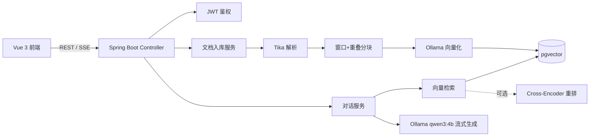

# 智枢 · 企业级 RAG 知识库问答系统

一套**全本地私有化部署**的企业知识库平台：上传企业文档（PDF / Word / Markdown / TXT），系统自动解析、分块、向量化入库；用户以对话方式提问，系统基于**检索增强生成（RAG）**返回**带引用来源的流式答案**。模型全部本地运行，**数据不出域、零 API 成本**。

## 架构



系统由两条链路组成：

- **离线入库**：上传 → 落元数据 → 异步解析/分块/向量化 → 写入 pgvector，前端轮询进度
- **在线问答**：问题向量化 → 向量召回 → 精排 → 拼装上下文 → 大模型流式生成 → SSE 推送

## 技术栈

| 层 | 选型 |
|---|---|
| 后端 | Spring Boot 3.4、Spring AI 1.0（`ChatModel` / `EmbeddingModel` / `VectorStore` 抽象） |
| 对话模型 | 本地 Ollama `qwen3:4b` |
| 嵌入模型 | 本地 Ollama `qwen3-embedding:4b`（2560 维） |
| 重排（可选） | Xinference + `Qwen3-Reranker-0.6B`（Cross-Encoder，可开关降级） |
| 向量库 | PostgreSQL 16 + pgvector |
| 文档解析 | Apache Tika 2.x |
| 鉴权 | Spring Security + JWT |
| 前端 | Vue 3 + Vite + TypeScript + Element Plus + Pinia + fetch-SSE |

## 核心功能

- 多用户登录与 JWT 鉴权，**多知识库租户隔离**（检索强制按 `kbId` 过滤）
- 文档上传 → 解析 → 分块 → 批量向量化入库，进度可观测
- 向量召回 + 精排（默认线性融合，可选 Cross-Encoder 重排）
- **流式问答**（SSE），答案附带**引用来源**，可追溯至具体文档与片段
- 知识库 / 文档管理：增删查、入库状态追踪、分块预览
- 资料不足时**明确拒答**，抑制幻觉

## 技术亮点

1. **异步入库管线**
   解析、分块、向量化耗时可达数十秒，若同步执行会占满请求线程并导致前端超时。因此 Controller
   仅落元数据、注册任务并投递 `@Async` 任务后**立即返回 taskId**，前端再轮询进度。

2. **先多召回、再精排**
   召回阶段按 `topK × 2` 取候选，避免"先截断再排序"漏掉更优片段；随后精排收敛到 `topK`。
   默认使用 `0.7 × 向量相似度 + 0.3 × 关键词命中率` 的线性融合（零额外推理开销）；
   开启 `rag.rerank.enabled` 后切换为 Cross-Encoder 重排，精度更高。

3. **可降级的外部依赖**
   重排依赖 Xinference 外部服务，一旦未启动、超时或返回异常，会自动降级回线性融合，
   保证问答链路始终可用，而不是整体失败。

4. **物理级租户隔离**
   检索时强制叠加 `kbId` 过滤条件，且过滤与向量相似度排序在**同一条 SQL** 内下发给 pgvector。
   数据库执行向量检索时根本不会扫描其它知识库的向量，而非"先全量召回再在应用层过滤"。

5. **端到端流式**
   后端通过 `SseEmitter` 先推送 `references`（引用来源），再逐 token 推送 `data` 事件；
   前端用 `fetch + ReadableStream` 增量解析并渲染，无需引入 EventSource（它无法携带 JWT）。

6. **模型无关的业务代码**
   业务层依赖 Spring AI 的 `ChatModel` / `EmbeddingModel` / `VectorStore` 接口，而非具体厂商实现。
   更换模型供应商（Ollama → Xinference → 云端 DashScope）只需调整配置，业务代码无需改动。

7. **可控生成**
   系统提示限定答案必须来自给定上下文、必须标注来源编号，并明确允许"资料中没有就说明无法回答"，
   从提示层面抑制幻觉；每个片段都携带 `【来源：文件名 #块号】` 以支持溯源。

## 快速开始

### 方式一：本地开发（推荐）

```bash
# 1) 启动数据库
docker compose up -d postgres

# 2) 确保 Ollama 已就绪并拉取模型
ollama pull qwen3:4b
ollama pull qwen3-embedding:4b

# 3) 构建并启动后端
build-backend.bat
run-backend.bat

# 4) 启动前端
cd frontend && npm install && npm run dev
```

- 前端：http://localhost:5173
- 后端 API：http://localhost:8080/api
- 默认账号：**admin / admin123**

### 方式二：Docker 一键编排

```bash
docker compose up -d
```

- 前端：http://localhost:8088
- 后端 API：http://localhost:8080/api

## 目录结构

```
EntRAG/
├── backend/                    # Spring Boot 工程
├── frontend/                   # Vue 3 工程
├── docs/                       # 技术文档
├── resume-docx/                # 简历文档生成脚本
├── docker-compose.yml          # 编排 postgres / ollama / backend / frontend / xinference
├── build-backend.bat           # 后端打包
├── run-backend.bat             # 后端启动（含环境变量）
└── README.md
```

## API 概览

| 方法 | 路径 | 说明 |
|---|---|---|
| POST | `/api/auth/login` | 登录，返回 JWT |
| POST | `/api/auth/register` | 注册 |
| GET | `/api/kb` | 知识库列表（按当前用户隔离） |
| POST | `/api/kb` | 新建知识库 |
| DELETE | `/api/kb/{id}` | 删除知识库 |
| POST | `/api/kb/{kbId}/docs` | 上传文档，返回 taskId |
| GET | `/api/kb/{kbId}/docs` | 文档列表 |
| GET | `/api/kb/ingest/status/{taskId}` | 入库进度 |
| GET | `/api/kb/{kbId}/docs/{docId}/chunks` | 分块预览 |
| GET | `/api/kb/{kbId}/chat?question=...` | SSE 流式问答 |

SSE 事件序列：

```
event:references   本次引用的文档片段
data:"token"       每个 token 一条
event:done         生成结束
```

## 配置项

| 配置 | 默认值 | 说明 |
|---|---|---|
| `rag.chat.model` | `qwen3:4b` | 对话模型 |
| `rag.chat.top-k` | `5` | 最终送入上下文的片段数 |
| `rag.chunk.size` / `overlap` | `512` / `64` | 分块窗口与重叠 |
| `rag.rerank.enabled` | `false` | 是否启用 Cross-Encoder 重排 |
| `rag.rerank.base-url` | `http://localhost:9997` | Xinference 地址 |
| `rag.rerank.model` | `Qwen3-Reranker-0.6B` | 重排模型名 |
| `RAG_CORS_ALLOWED_ORIGINS` | — | **不能设为 `*`**，与 `allowCredentials(true)` 组合会导致 Spring 抛异常 |

## 已知约束

- **pgvector 的 HNSW 索引维度上限为 2000**，而 `qwen3-embedding:4b` 输出 **2560 维**，
  因此当前 `index-type` 设为 `NONE`（精确检索）。更换嵌入模型时需重新核对「模型维度 ↔ 列维度 ↔ 索引类型」三者匹配。
- `qwen3` 为推理型模型，默认会输出思考过程。本项目在 system 提示末尾追加 `<arg_key:6124c78e>` 关闭思考，
  否则推理内容会混入答案且首个 token 延迟数秒。
- 重排为外部服务（Xinference），通过开关控制，未启用时自动使用线性融合。
- 4B 对话模型能力有限，依赖检索质量；如需更强能力，可切换更大的本地模型或云端模型（配置层改动即可）。

## 文档

| 文档 | 内容 |
|---|---|
| [01-架构总览](./docs/01-架构总览.md) | 技术选型、分层结构、数据模型、pgvector 选型依据 |
| [02-入库流程](./docs/02-入库流程.md) | 异步入库管线、分块策略、状态机 |
| [03-问答流程](./docs/03-问答流程.md) | 检索、精排、生成与 SSE 事件格式 |
| [04-踩坑与排障](./docs/04-踩坑与排障.md) | 实际遇到并修复的问题与排查方法 |
| [05-本地启动与验证](./docs/05-本地启动与验证.md) | 启动步骤、自检清单、端到端验证 |
| [07-Rerank 接入与选型](./docs/07-Rerank接入与选型.md) | Cross-Encoder 接入、降级设计与选型对比 |
