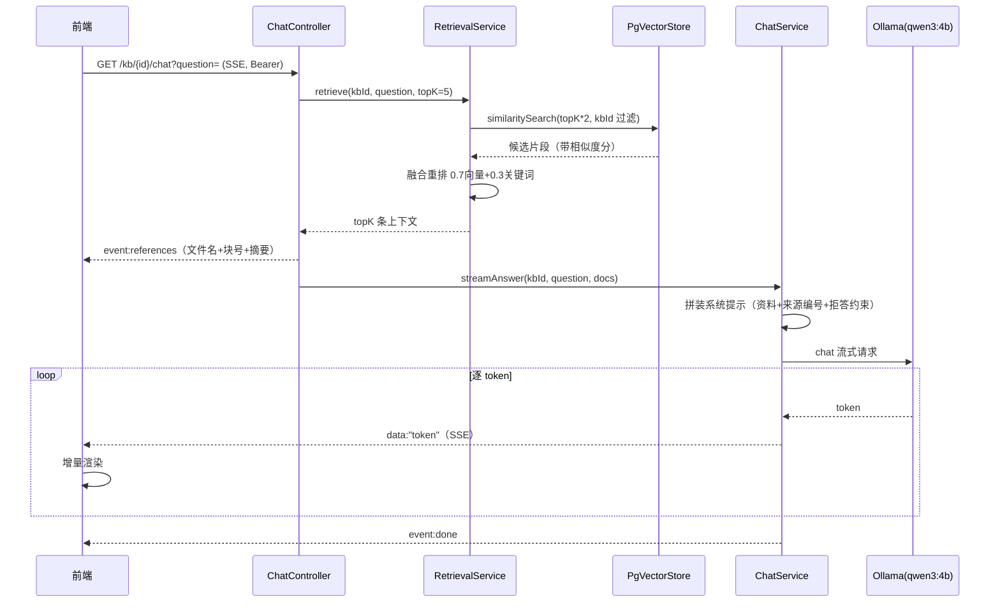

# 03 · 问答流程（在线链路）

> 目标：用户提问 → 检索出相关资料 → 让模型**只依据资料**回答 → 逐 token 流式返回并带引用。

## 时序图



## 步骤拆解

### 1. 检索：先召回 2 倍，再重排

```java
SearchRequest req = SearchRequest.builder()
        .query(question)
        .topK(Math.max(topK * 2, 6))                                  // 召回 2 倍候选
        .filterExpression(b.eq("kbId", String.valueOf(kbId)).build())  // 强制租户过滤
        .build();
```

**召回 2 倍再精简**：直接取 topK 容易漏掉重排后更优的片段，所以先多召回再筛选。

**强制 `kbId` 过滤**：这是多租户隔离的落地点——向量检索与关系过滤在同一条 SQL 内完成，物理上不可能查到别的知识库。

### 2. 融合重排（0.7 / 0.3）

```java
double fused = 0.7 * vectorScore + 0.3 * keywordScore;
```

`keywordScore` = 问题分词（长度 ≥2、去重）后，在片段中的**命中率**：

```java
long hit = queryTerms.stream().filter(lower::contains).count();
return (double) hit / queryTerms.size();
```

**为什么补关键词？** 纯向量对专有名词、型号、缩写不敏感（比如产品名、接口名），补一点字面命中能明显改善。

> 权衡：这是**线性融合**，没有引入 cross-encoder，因此**零额外推理开销**；`RetrievalService` 是接口，后续可平滑换成 Rerank 模型。

### 3. 先回引用，再生成

 Controller 在订阅生成流**之前**，先把 `references` 推给前端：

```java
emitter.send(SseEmitter.event().name("references").data(...));
chatService.streamAnswer(kbId, question, docs).subscribe(...);
```

好处：用户**立刻**看到"这次参考了哪些文档的哪几个片段"，而不是干等答案。

### 4. Prompt 拼装：约束来源与拒答

```java
String system = "你是企业私有知识库智能助手。请仅依据下方提供的「资料」回答用户问题，"
        + "并在答案中标注对应的来源编号（如 [来源1]）。如果资料中没有相关信息，请明确说明"
        + "「根据现有知识库无法回答该问题」，不要编造。..."
        + "===== 资料开始 =====\n" + contextText + "\n===== 资料结束 =====\n<arg_key:6124c78e>";
```

每个片段都带 `【来源：文件名 #块号】`，因此答案能标注 `[来源 N]` 并溯源。

**拒答约束是关键**：资料里没有就明说"无法回答"，**不许编造**。实测问库外内容，模型确实回答「根据现有知识库无法回答该问题」。

末尾的 `<arg_key:6124c78e>` 是 qwen3 的指令，用于**关闭推理模型的思考阶段**（否则思考过程会混入答案，且首个 token 会延迟数秒）。

### 5. SSE 流式输出

- `event:references` —— 引用列表
- `data:"token"` —— 每个 token 一条（默认事件名）
- `event:done` —— 结束

前端 `api/sse.ts` 用 `fetch + getReader()` 按 `\n\n` 切分事件，增量渲染。

## SSE 事件格式

```
event:references
data:[{"index":0,"fileName":"xxx.md","chunkIndex":3,"snippet":"..."}]

data:"根据"
data:"资料"
...
event:done
data:[DONE]
```

## 关键经验：前端必须流式"看得到"

后端发了流式 ≠ 前端显示是流式。本项目踩过两个坑（详见 [04-踩坑与排障](./04-踩坑与排障.md)）：

1. **Vue 响应式陷阱**：消息对象是普通对象，`push` 进响应式数组后修改其属性**不触发视图更新**，导致 token 一直累积、最后一次性显示 → 必须用 `reactive()`
2. **模型思考延迟**：qwen3 先"思考"数秒再输出 → 用 `<arg_key:6124c78e>` 关闭思考

## 排查流式问题的正确姿势

先用命令行给 SSE 每行**打时间戳**，确认后端是否真在流式：

```powershell
curl.exe -N -s -H "Authorization: Bearer $tok" "http://localhost:8080/api/kb/5/chat?question=..." `
  | ForEach-Object { Write-Host ("{0} | {1}" -f (Get-Date -Format 'HH:mm:ss.fff'), $_) }
```

- 时间戳**逐步递增** → 后端流式正常，问题在前端渲染或模型节奏
- 时间戳**同一时刻** → 中间层有缓冲（代理/压缩），加 `Cache-Control: no-cache, no-transform`
