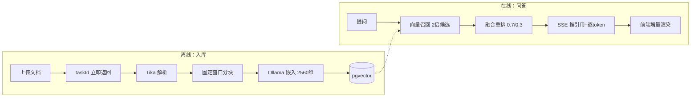

# 智枢 · 企业级 RAG 知识库问答系统 —— 文档索引

面向**企业私有化交付**场景的 RAG 全栈样例：文档解析 → 分块 → 向量化入库 → 检索增强 → 流式生成，模型全部本地运行（Ollama），数据不出域。

## 文档列表

| 文档 | 内容 | 适合谁看 |
|---|---|---|
| [01-架构总览](./01-架构总览.md) | 技术选型、分层结构、数据模型、为什么这么选 | 想快速建立整体认知 |
| [02-入库流程](./02-入库流程.md) | 文档从上传到变成向量的完整链路（异步管线） | 想搞懂离线侧 |
| [03-问答流程](./03-问答流程.md) | 提问到流式答案的完整链路（检索 → 重排 → SSE 生成） | 想搞懂在线侧 |
| [04-踩坑与排障](./04-踩坑与排障.md) | 本项目实际踩过并修复的真实问题 | 排障 / 经验参考 |
| [05-本地启动与验证](./05-本地启动与验证.md) | 一键启动步骤与端到端自测方法 | 要把它跑起来 |

## 一图看懂两条链路



## 快速启动

```bash
# 1) 启动 PostgreSQL(pgvector)
docker compose up -d postgres

# 2) 构建并启动后端（需本机 JDK17 + Maven，Ollama 已就绪）
build-backend.bat
run-backend.bat

# 3) 启动前端
cd frontend && npm run dev
```

访问 http://localhost:5173 ，默认账号 `admin` / `admin123`。
详见 [05-本地启动与验证](./05-本地启动与验证.md)。
